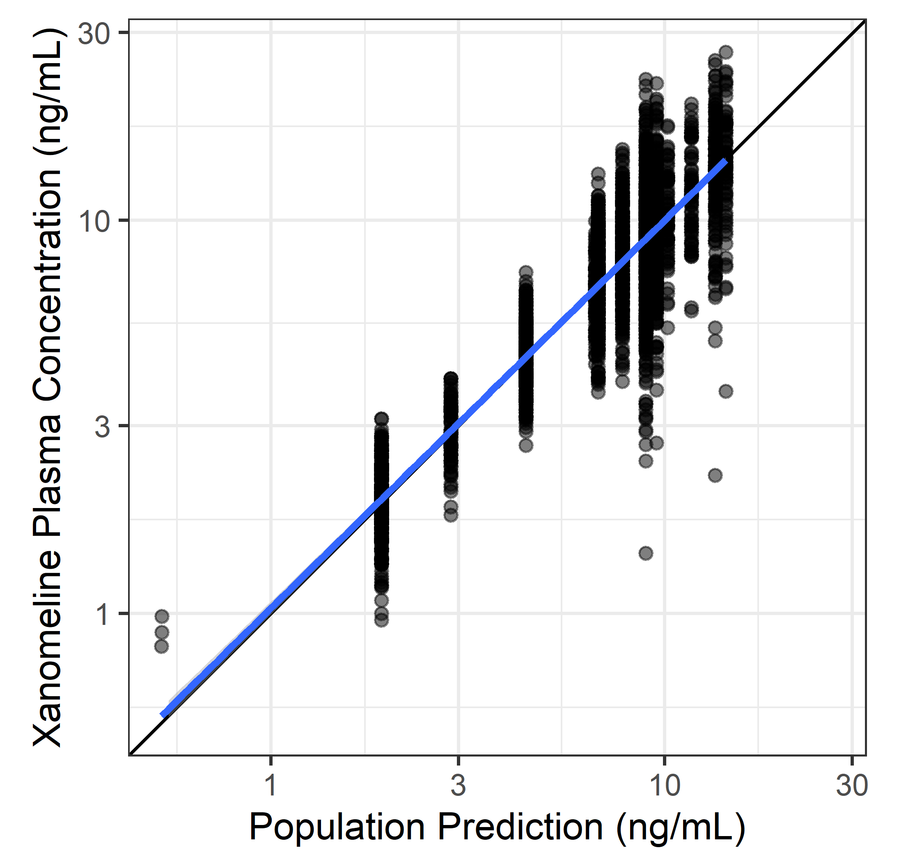

# Data Diagnostics

## DV vs IPRED by ACTARM per VISIT

## DV vs IPRED

## DV vs IPRED log-log

## DV vs PRED and IPRED

## DV vs IPRED, untransformed and log-log

## IWRES vs TIME

## IWRES vs TIME, untransformed and log-log

