# Data Diagnostics

## Observations vs Individual Predictions by Arm, per Visit

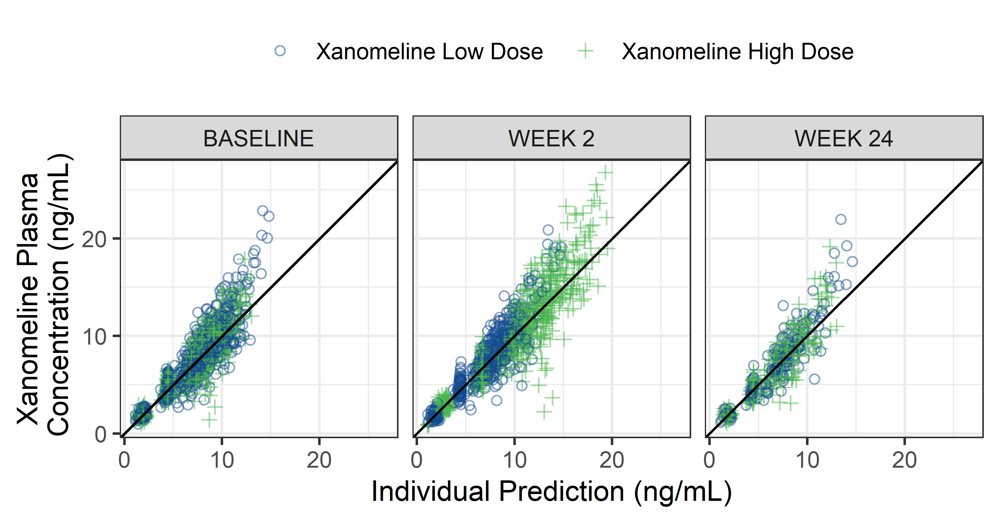

## Observations vs Individual Predictions

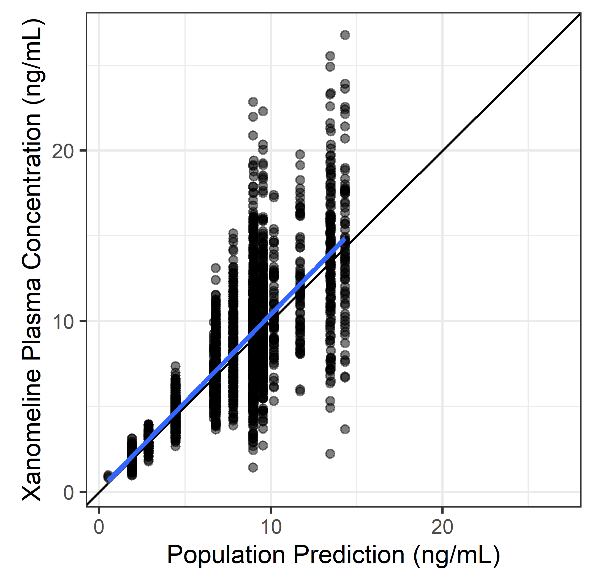

## Observations vs Individual Predictions, With/without Grids

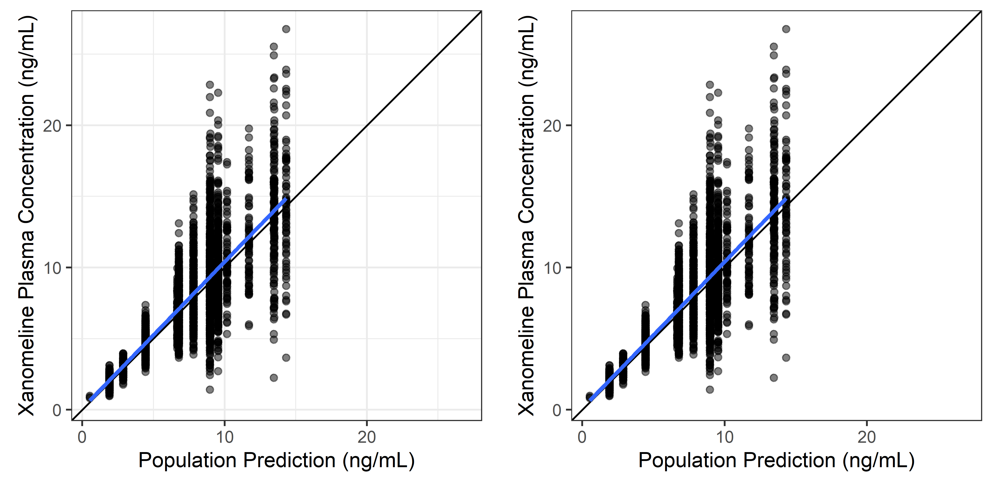

## Observations vs Population Predictions, Log-log

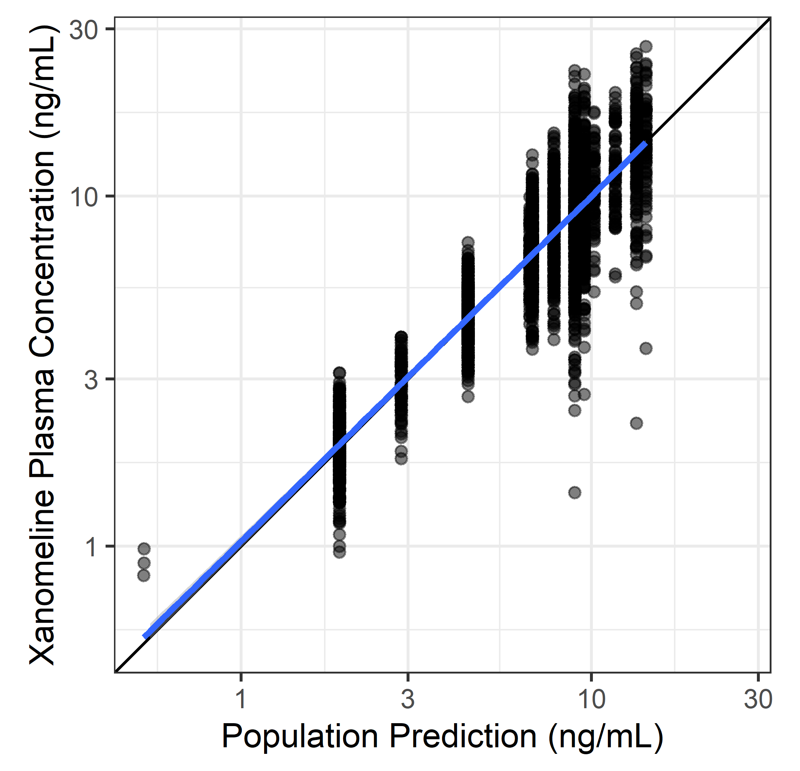

## Observations vs Population and Individual Predictions

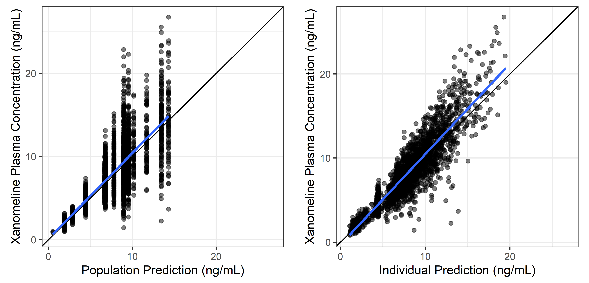

## Observations vs Individual Predictions, Untransformed and Log-log

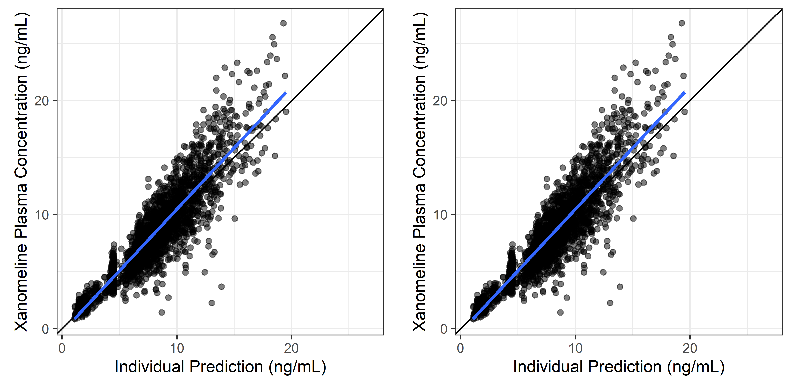

## Individual Weighted Residuals vs Time

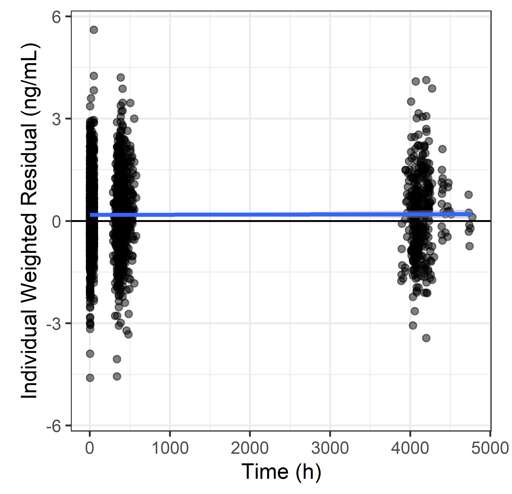

## Individual Weighted Residuals vs Time, Untransformed and Log-log

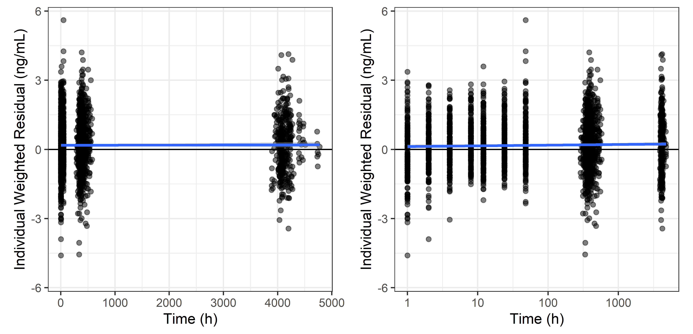

## Individual Weighted Residuals vs Time, Full Grid vs Horizontal Grid

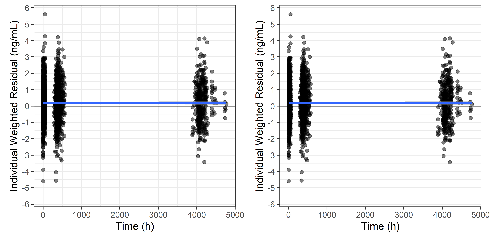<!-- -->

## Individual Weighted Residuals vs Time, Various Horizontal Reference Lines

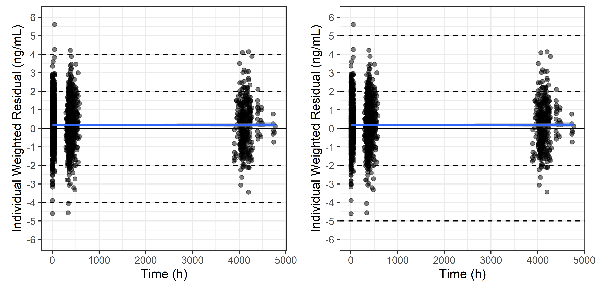<!-- -->

## Individual Plots

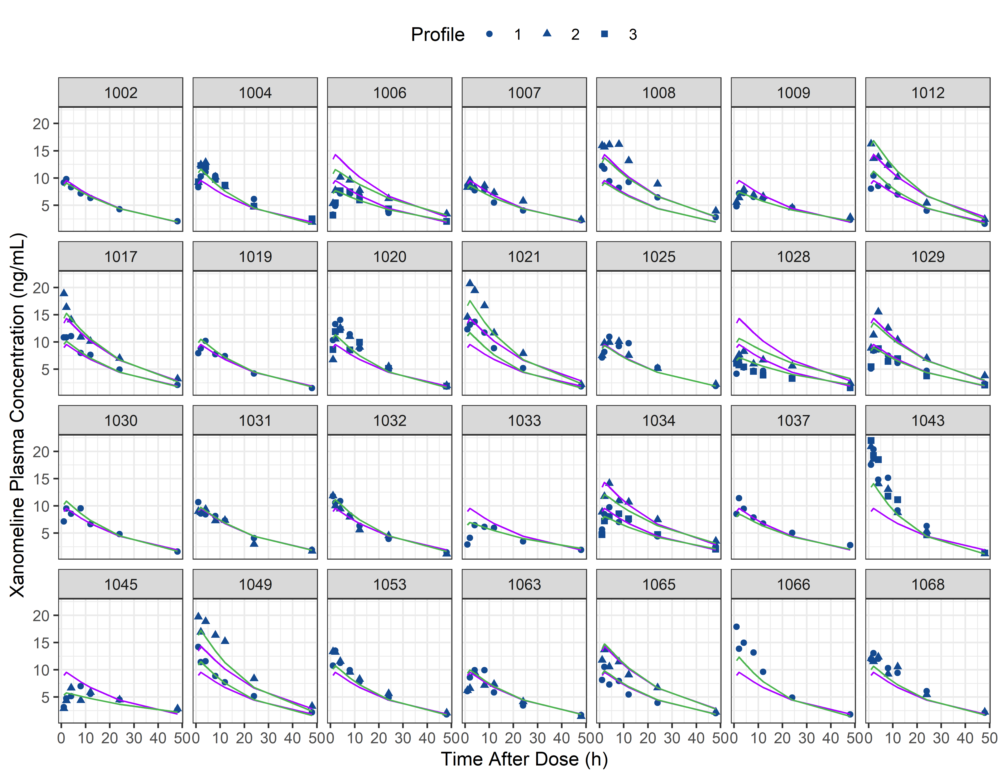<!-- -->

## Individual Plots -- Detailed Panel Strip

<!-- -->
