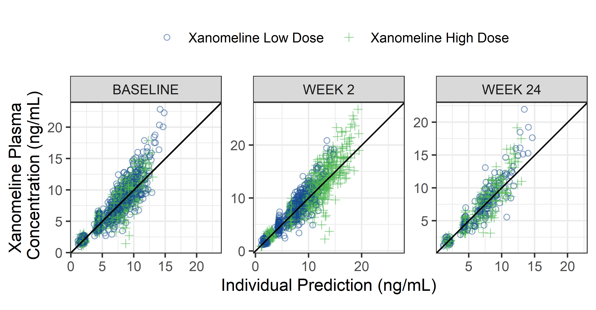
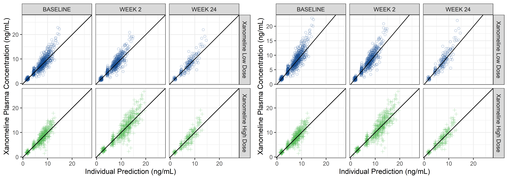
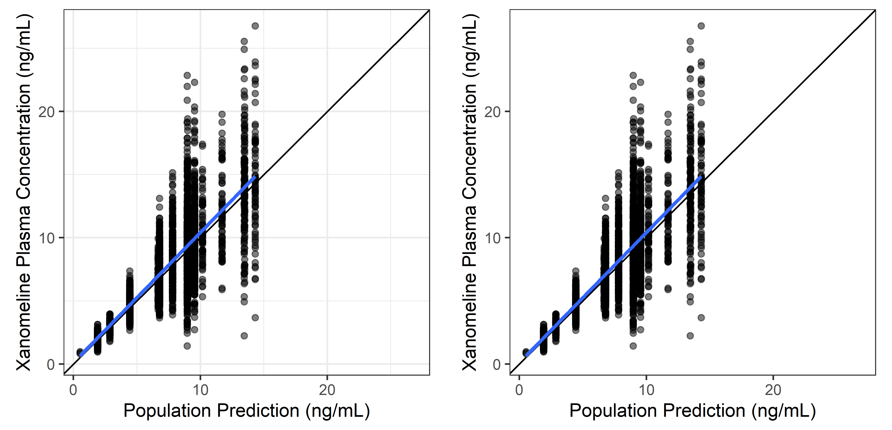
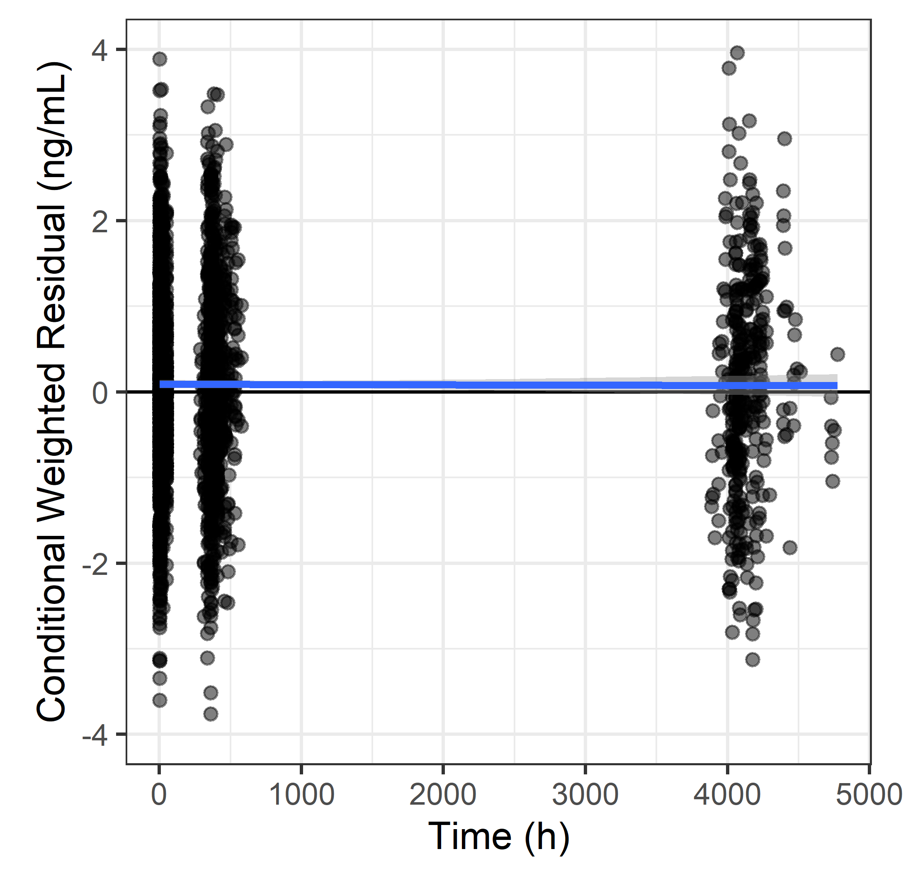
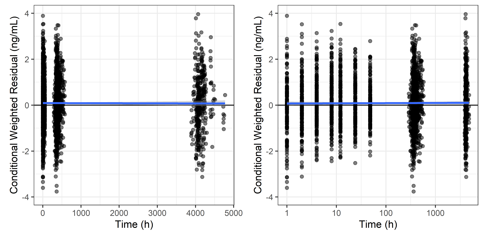
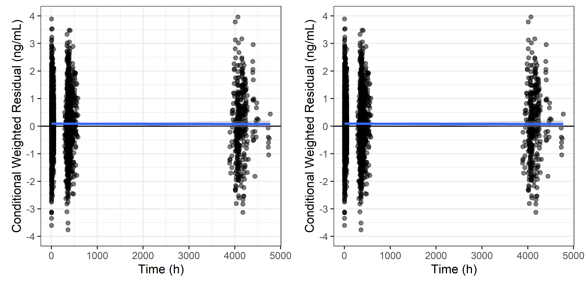
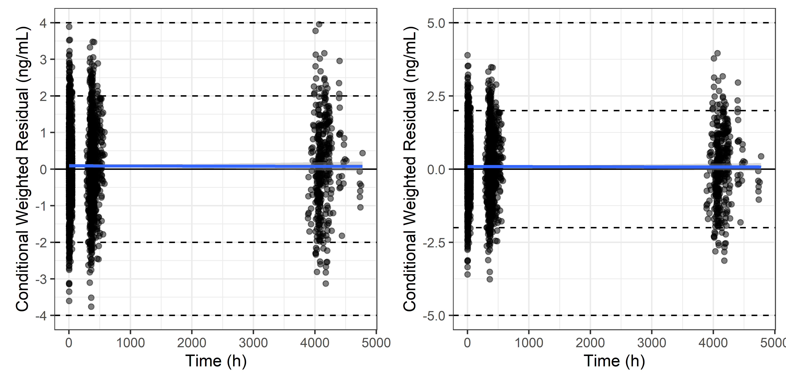
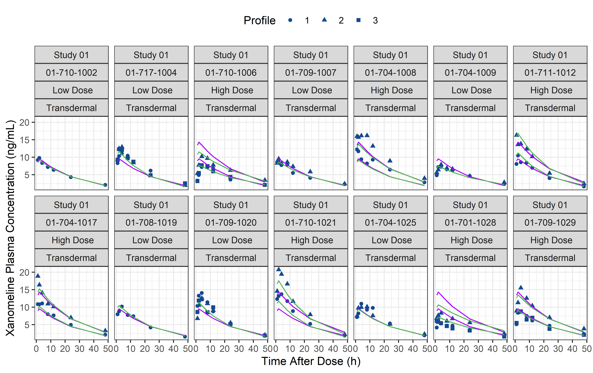
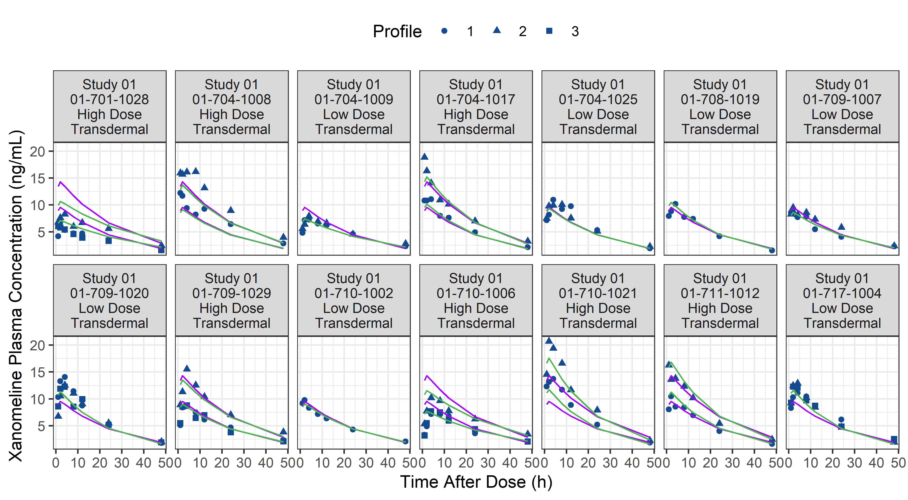
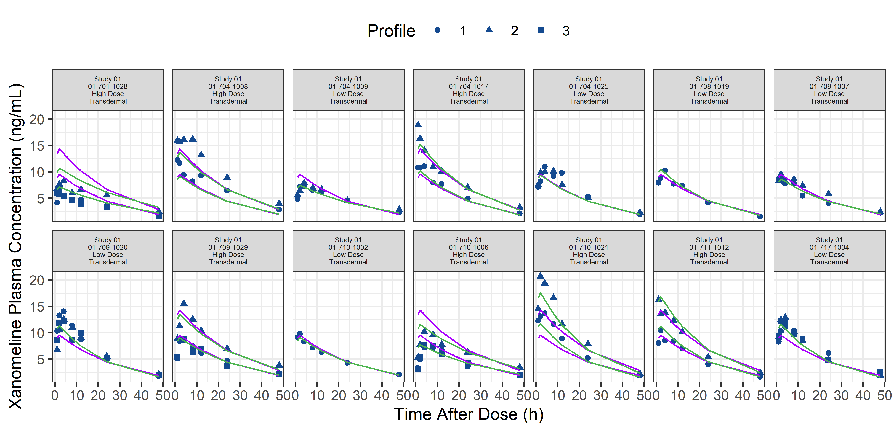

# Data Diagnostics

## Observations vs Individual Predictions by Arm, per Visit

## Observations vs Individual Predictions by Arm and Visit, and for scales = 'free'

## Observations vs Individual Predictions

## Observations vs Individual Predictions, With/without Grids

## Observations vs Population Predictions, Log-log

## Observations vs Population and Individual Predictions

## Observations vs Individual Predictions, Untransformed and Log-log

## Conditional Weighted Residuals vs Time

## Conditional Weighted Residuals vs Time, Untransformed and Log-log

## Conditional Weighted Residuals vs Time, Full Grid vs Horizontal Grid

<!-- -->

## Conditional Weighted Residuals vs Time, Various Horizontal Reference Lines

<!-- -->

## Individual Plots

<!-- -->

## Individual Plots -- Detailed Panel Strip

<!-- -->

## Individual Plots -- Unscaled Panel Strip

<!-- -->

## Individual Plots -- Scaled Panel Strip

